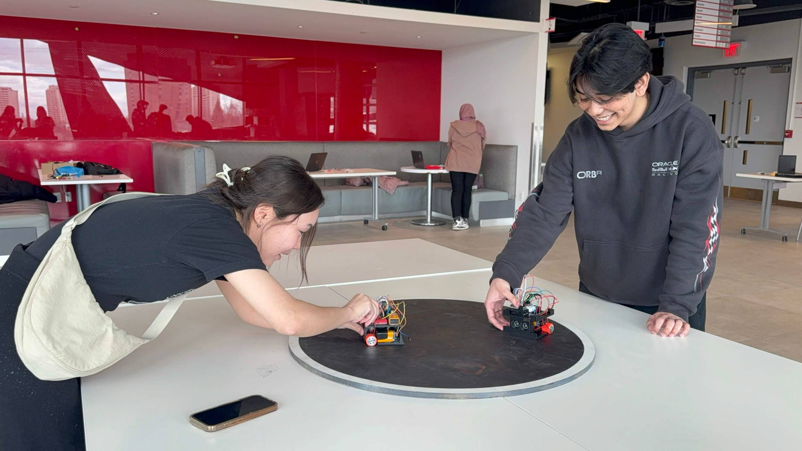
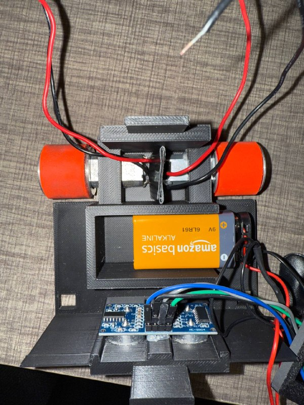
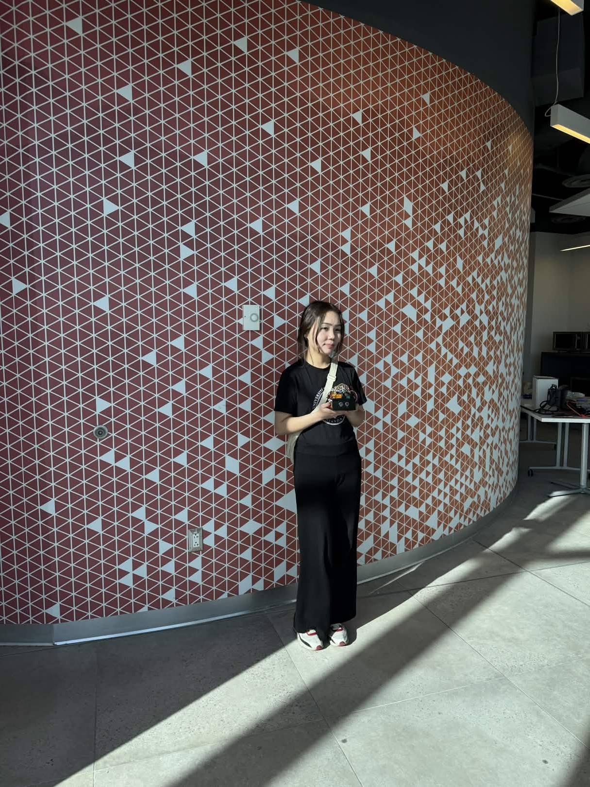
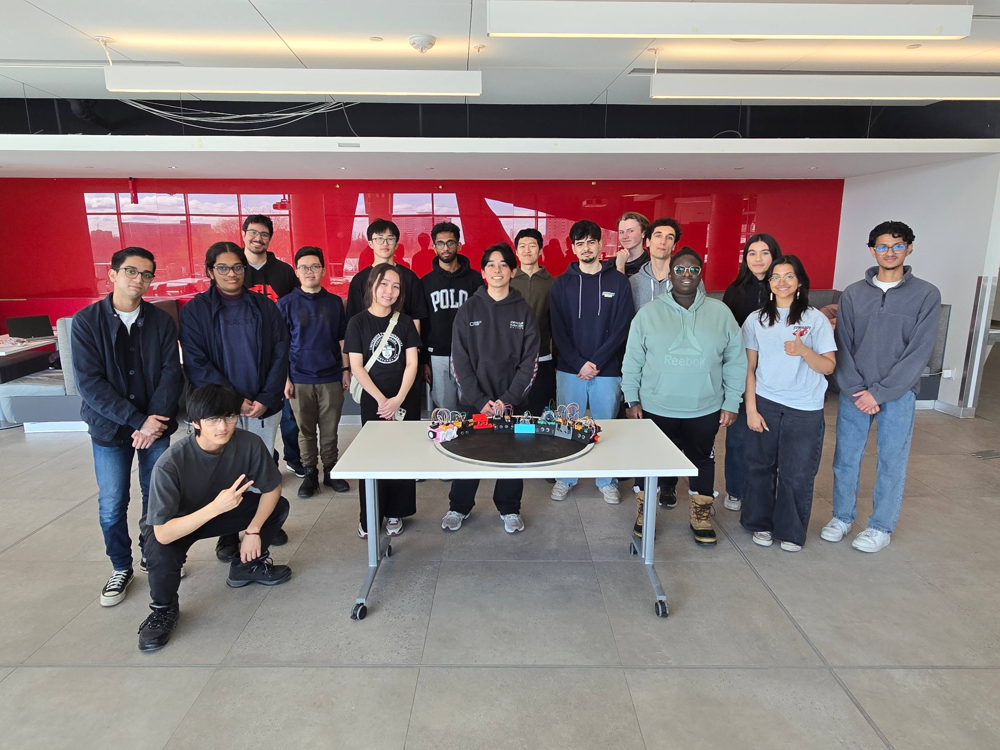

# 🤖 Autonomous SumoBot

**2nd Place - York University SumoBot Competition**  
Autonomous Arduino-based sumo robot built for inter-university robotics competition between York University, University of Toronto, and McMaster University.

## Overview

This project is a fully autonomous sumobot designed to detect opponents, avoid arena edges, and compete in a robotics sumo arena. The robot uses an Arduino Nano for control, IR sensors for edge detection, and an ultrasonic sensor for opponent tracking. The chassis was designed in CAD and 3D printed.

The project was developed as part of the York University Robotics Society and achieved **2nd place** in the York University SumoBot Competition.

## Tech Stack

- **Microcontroller:** Arduino Nano
- **Programming:** C++ / Arduino IDE
- **Sensors:** Ultrasonic sensor, IR edge-detection sensors
- **Actuators:** DC motors, motor driver
- **Design:** CAD, 3D-printed chassis
- **Tools:** Arduino IDE, multimeter, soldering/prototyping tools

## Features

- Autonomous opponent detection using an ultrasonic sensor
- Arena edge detection using downward-facing IR sensors
- Attack and avoidance logic for sumo-style competition
- Modular hardware/software design for testing and iteration
- Manual and autonomous start modes

## Hardware Overview

The robot includes:

- Arduino Nano control board
- Ultrasonic sensor for front-facing opponent detection
- IR sensors for detecting the white arena boundary
- Motor driver for controlling dual DC motors
- Custom 3D-printed chassis

CAD files are available in the `/hardware/` folder.

## Software Overview

The robot control logic is written in C++ using the Arduino IDE. The code handles sensor readings, edge avoidance, opponent detection, and movement decisions.

Arduino `.ino` files for the main logic and sensor testing are available in the `/code/` folder.

## Demo and Media
Watch the demo (my bot is on the left!):  
https://youtube.com/shorts/j7H8w4HQo3c?feature=share

| Before Round | Midway Build |
|---|---|
|  |  |

| With Robot | Competition |
|---|---|
|  |  |

## Author

**Aruzhan Massalina**  
Computer Engineering Student @ York University  
York University Robotics Society  

[LinkedIn](https://www.linkedin.com/in/aruzhan-massalina-2528251b1)
